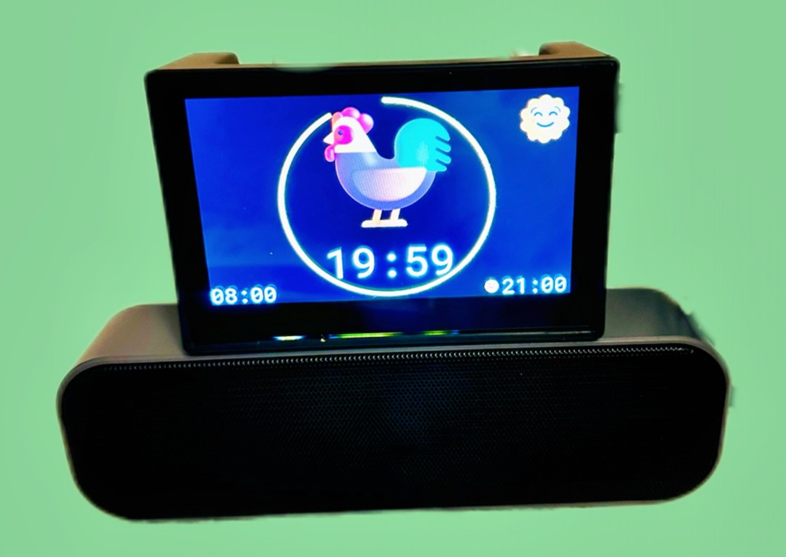

# gab-alarm

## Children's Sleep Alarm Clock

`gab-alarm` is a full-stack children's sleep alarm clock.
It's intended to run on a raspberry-pi with a touchscreen and
includes an admin interface.

See this [presentation](https://www.youtube.com/live/_Z113lPt0iw?si=u7vqOVEfWcQf7JZL&t=1620) and [slides](https://docs.google.com/presentation/d/18WWd3wvjbfif7r3_V0g3amJl9sT-ilWFDtG4V8Gbb64/edit?usp=sharing) for more information.

## Tech Stack

- Backend: Node.js + Fastify
- Frontend: React + websockets

## Setup

⚠️ Requires node.js v22.6+ due to [experimental type stripping](https://nodejs.org/docs/latest/api/typescript.html#type-stripping) support.

1. `pnpm install`
2. `pnpm run build && pnpm run start`

## Development
- run with watch `pnpm run dev`
- lint `pnpm run lint`
- test `pnpm run test`
